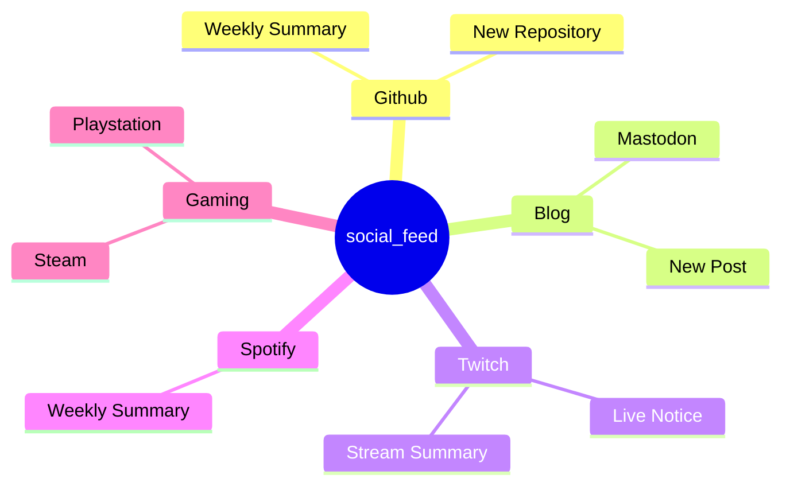
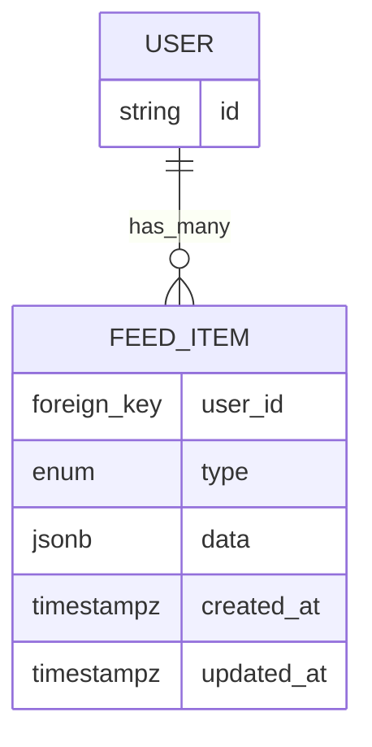

A list of events that we want to show

This will probably need some ingress point for webhooks for some of this data, like from Github and Twitch

This diagram represents a potential database schema to represent the feed

